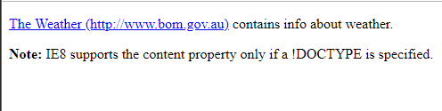

[Code-Refernces ](https://samuelmeddows.github.io/code-reference/ "Code-Refernces") >
[ Generic Content](https://samuelmeddows.github.io/code-reference/HTML5/GenericContent "Generic Content")
# HTML5 Generic Content

### HTML5 Code


```html
<!DOCTYPE html>
<html>
	<head>
        	<style type="text/css">
        		a:after {content: " (" attr(href) ")";}
        	</style>
	</head>

	<body>
		<p><a href="http://www.bom.gov.au">The Weather</a> contains info about weather.</p>
		<p><b>Note:</b> IE8 supports the content property only if a !DOCTYPE is specified.</p>
	</body>
</html>
```


### Example




### Live Example
[Generic Content Example](https://html5-css-javascript-examples.azurewebsites.net/HTML5/GenericContent.html "Generic Content Example")

